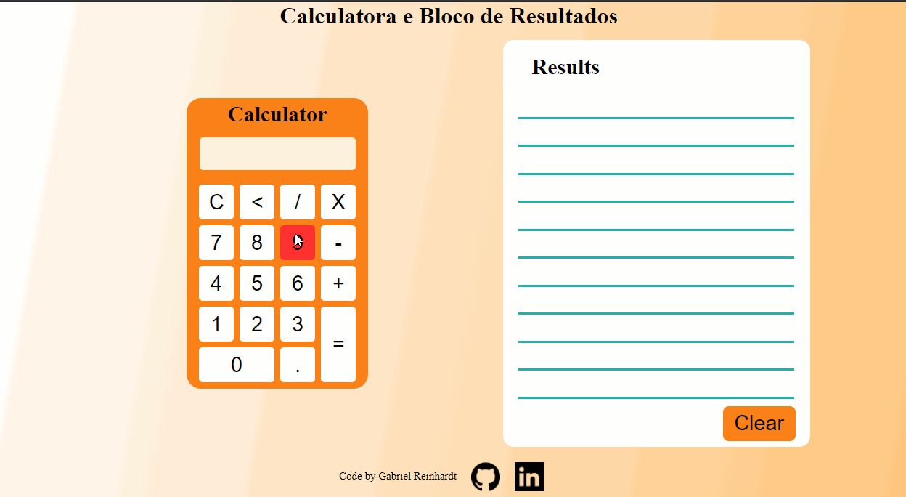

# Calculator

 
Meu primeiro projeto, realizando lógica de operações mátematicas

 
<h2> Projeto praticar HTML, CSS e realizar cálculos com JS</h2>

Estes códigos foram meus primeiros passos em desenvolvimento.

<h2> Prévia: </h2>
